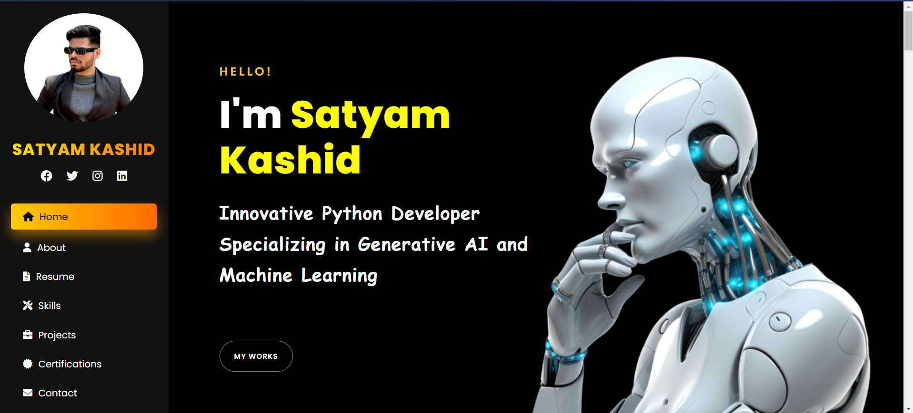
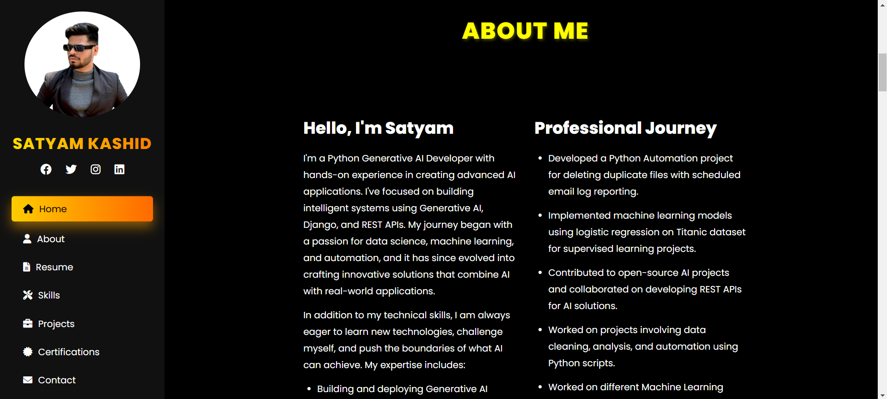
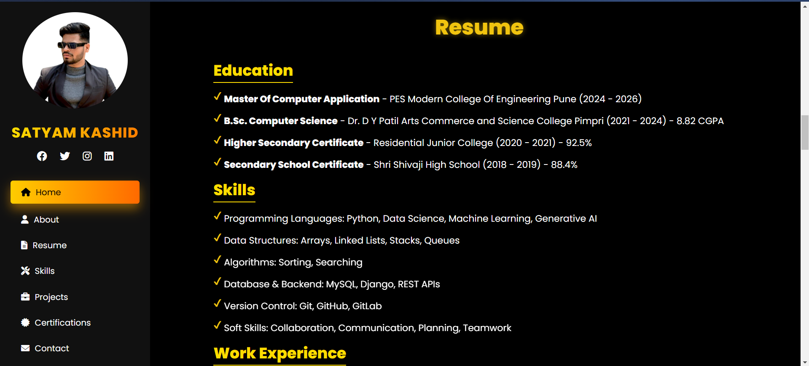
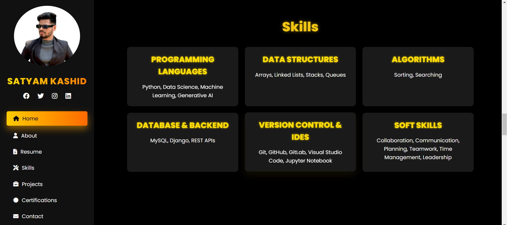
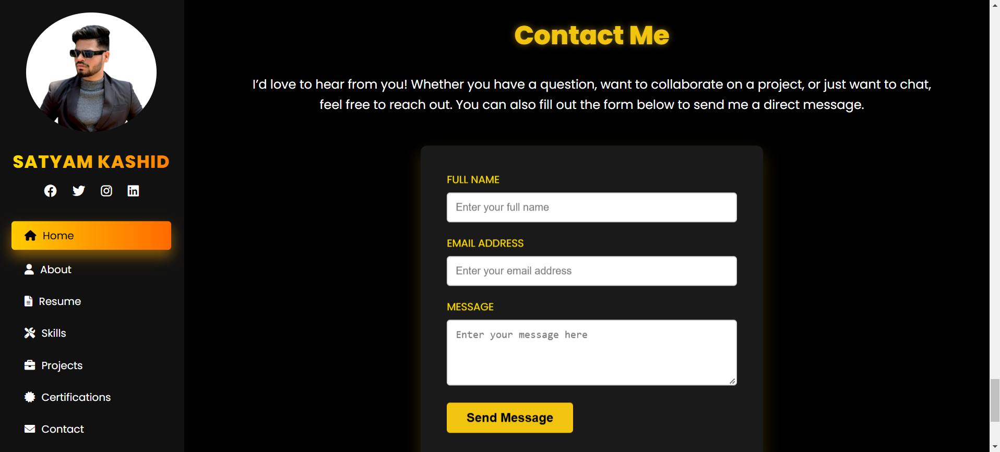

## My Personal Portfilio Website (Django)

Personal portfolio website made with Django framework in the backend, and with CSS and Bootstrap for the frontend. It is a dynamic site so that you can control the content of the site through the admin area

## Screenshots










## Run Locally

Clone the project

```bash
git clone https://github.com/Satyamkashid/Portfolio.git
```

Go to the project directory

```bash
  cd Portfolio
```

MAKE  Migration

```bash
  python manage.py makemigrations
```

MAKE  Migration

```bash
  python manage.py migrate     
```
Start the server

```bash
  python manage.py runserver     
```
